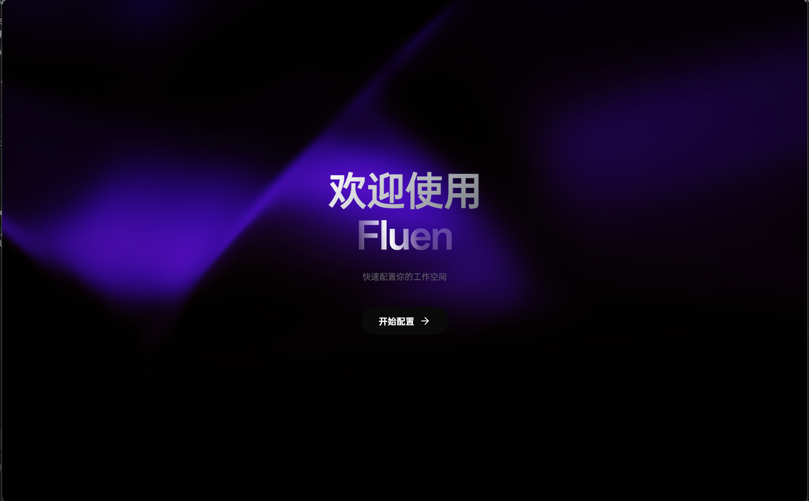
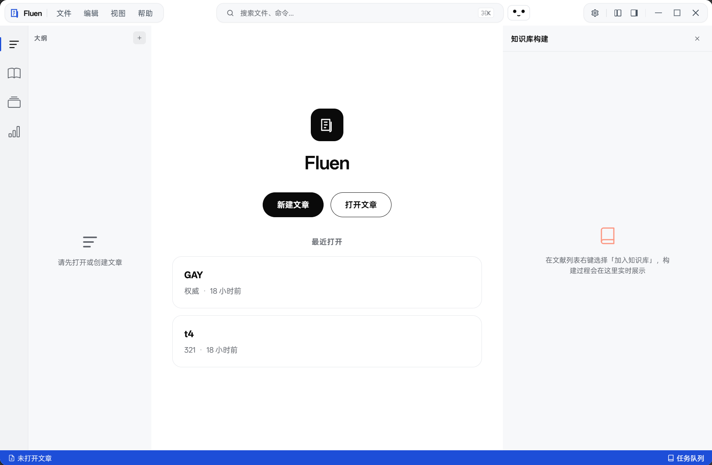
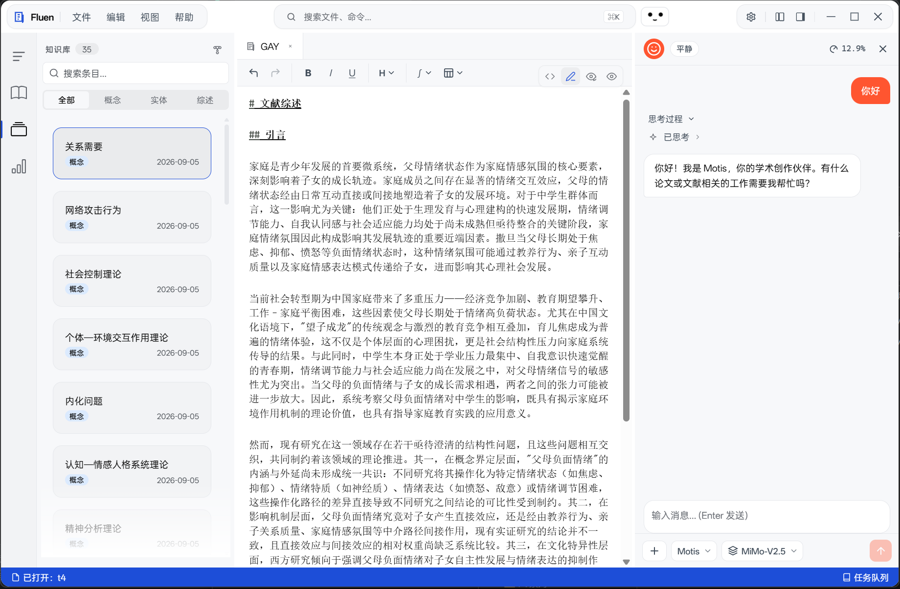

# Fluen

**本地优先的学术创作平台** —— 用 LLM 与 OCR 辅助文献研读、知识沉淀与论文写作，数据完全留在你自己的电脑上。

> 版本 0.0.1-beta · Windows / macOS / Linux · Tauri 2 + Vue 3 + Rust



## 为什么做 Fluen

写一篇论文的真实流程，往往横跨五六个工具：PDF 阅读器做笔记、Excel 存实验数据、SPSS 跑统计、Notion/Obsidian 沉淀知识、Word/LaTeX 排版成稿。工具之间的缝隙，正是效率与专注流失的地方。

Fluen 把这条链路收进一个本地应用：文献、知识库、数据、正文共存于同一个论文项目里，AI 在每一步就位，但数据不出本机（LLM 调用除外，供应商与端点由你自行配置）。

## 核心特性

### 论文即项目

每篇论文是一个遵循固定规范的独立目录：`config.yaml` 记录元信息，`references/` 存放文献与知识库，`data/` 存放实验/问卷数据，`manuscript/` 以章节为单位存放正文。全部内容为纯文本（Markdown / YAML / CSV / SQLite），可被 Git 管理、可被任何工具直接打开——不锁定，不黑盒。

### 文献导入与研读

- PDF 导入后转换为 Markdown（基于 `pdf_oxide`），并可通过 OCR + AI 校对修复转换文本
- 内置阅读器支持自定义标记（marks），与文献条目关联

### AI 自动构建知识库

对导入的文献一键启动知识库构建任务：AI Agent 按流水线生成**综述、概念、实体**三类 Wiki 条目，并为条目间建立类型化关系，形成跨文献的知识网络。

- 全程通过 MCP 工具操作知识库（查询、创建、合并、建立关系），Agent 每一步可审计
- 条目正文携带来源标记（`<ref-…>` 溯源到具体文献）
- SQLite FTS5 全文索引 + 可选向量检索，嵌入模型可配置或关闭（回退关键词检索）
- 构建任务具备阶段化检查点（Planning → Summary → Concepts → Entities → Relations），中断可恢复

### 半预览编辑器

- Markdown 是唯一事实来源，所见即所得是派生物——不是反过来
- 基于 CodeMirror 6 的块级渲染半预览模式：正在编辑的块是源码，其余块实时渲染
- KaTeX 数学公式、代码高亮、快捷键三视图切换（源码 / 半预览 / 仅渲染）

### 内置统计分析

实验数据直接在应用内分析，无需导出到 SPSS——统计能力由自研 Rust 库 [`socstat`](crates/socstat) 提供：t 检验、方差分析、卡方检验、相关分析、回归、PCA、信度分析等。

### 可见的任务队列

文献导入、AI 校对、知识库构建等耗时任务统一进入任务队列：状态实时可见，完成可折叠归档，失败可重试。

## 技术架构

```
┌─────────────────────────────────────────────┐
│  Vue 3.5 前端                                │
│  CodeMirror 6 编辑器 · 任务队列 · 图谱 · 设置  │
├─────────────────────────────────────────────┤
│  Rust 后端 (Tauri 2)                         │
│  项目/编辑器/文献命令 · 任务队列 · MCP Host    │
├─────────────────────────────────────────────┤
│  自研 Rust crates                            │
│  referee (Agent 运行时) · fluen-kb (知识库)  │
│  socstat (统计) · fluen-markup (标记规范)     │
└─────────────────────────────────────────────┘
```

| Crate | 职责 |
| --- | --- |
| [`referee`](crates/referee) | Agent 框架：LLM 调用、工具调度、会话与 token 预算管理 |
| [`fluen-kb`](crates/fluen-kb) | 知识库 SDK：Markdown 条目 + 溯源 + 类型化关系 + SQLite(FTS5) 索引，支持 MCP Server |
| [`socstat`](crates/socstat) | 轻量统计分析库（csv / sav），附 `socstat-mcp` |
| [`fluen-markup`](crates/fluen-markup) | Fluen 论文标记规范（v1.1）解析与渲染 |

- **LLM 接入**：兼容 OpenAI 协议的多供应商配置，推理/非推理模型均可接入；API Key 以可逆混淆存储，避免明文落盘
- **数据路径**：遵循各平台官方规范，由 `platform.rs` 统一解析

| 平台 | 配置 | 数据 | 缓存 |
| --- | --- | --- | --- |
| Windows | `%APPDATA%\Fluen\` | `%LOCALAPPDATA%\Fluen\` | `%LOCALAPPDATA%\Fluen\Cache\` |
| macOS | `~/Library/Application Support/com.wppcp.fluen/` | 同左 | `~/Library/Caches/com.wppcp.fluen/` |
| Linux | `~/.config/Fluen/` | `~/.local/share/Fluen/` | `~/.cache/Fluen/` |

## 快速开始

前置要求：[Node.js](https://nodejs.org/) ≥ 20、[pnpm](https://pnpm.io/)、[Rust](https://www.rust-lang.org/)（含各平台 Tauri 依赖，见 [Tauri 2 文档](https://tauri.app/start/)）。

```bash
pnpm install
pnpm tauri dev     # 开发模式
pnpm tauri build   # 构建安装包
```

前端单元测试：`pnpm test`

## 界面一览





## 状态

0.0.1-beta，核心链路（文献导入、知识库构建、编辑器、统计分析）可日常使用，仍在快速迭代中。
